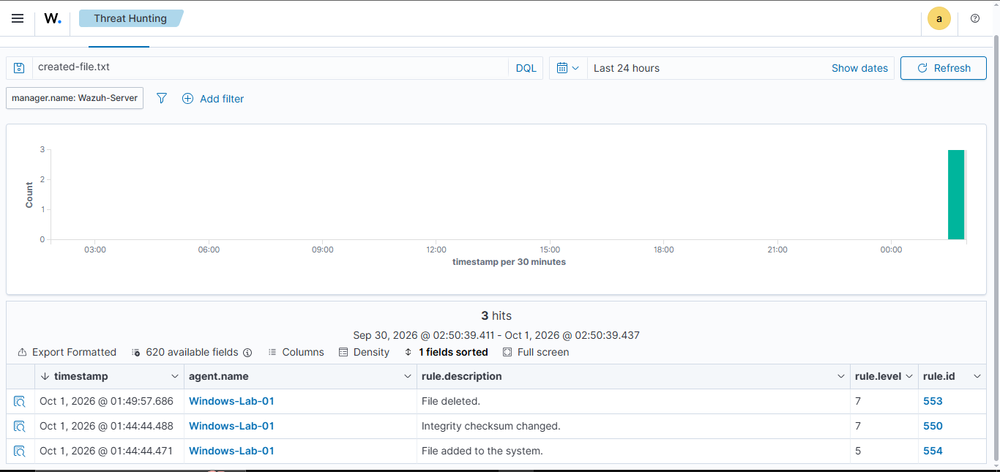
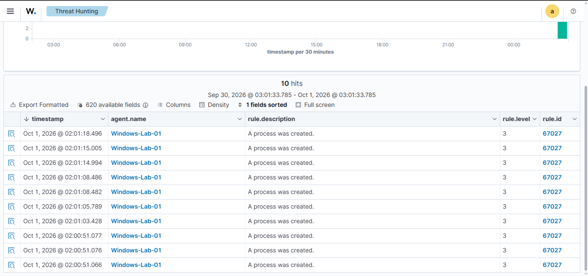
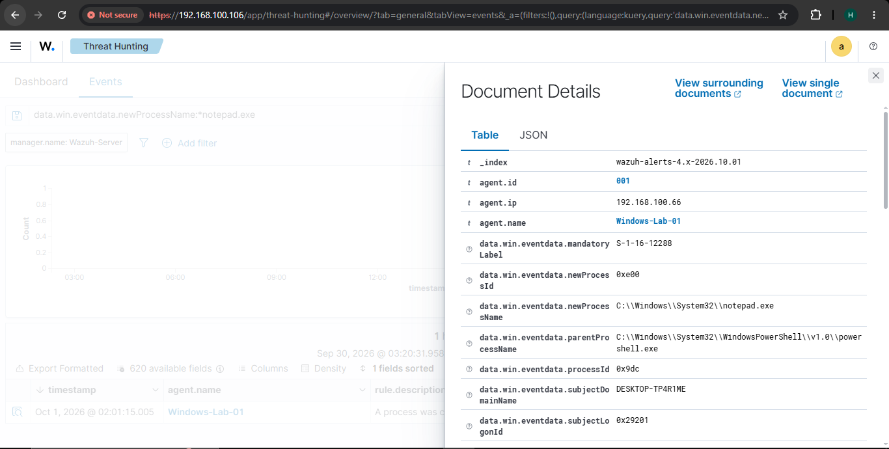
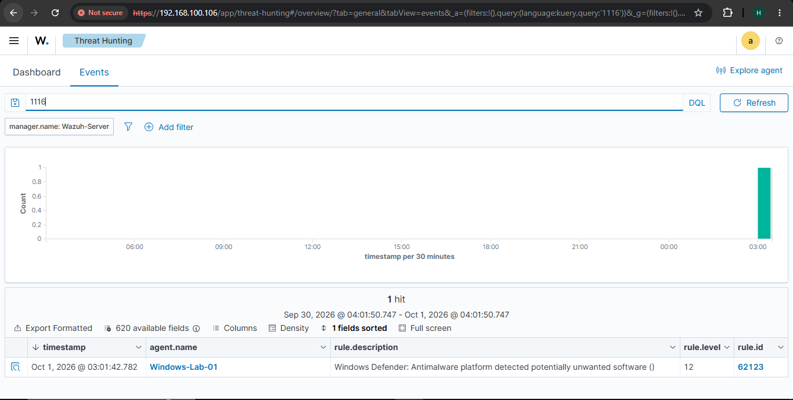

# Wazuh SOC Monitoring Lab

## Overview
This project demonstrates a hands-on Security Operations Center (SOC) monitoring lab using Wazuh.

The lab is designed to monitor a Windows endpoint, collect security logs, detect suspicious activity, and investigate security events in a controlled environment.

## Objectives
- Deploy Wazuh on Ubuntu Server
- Connect a Windows endpoint using Wazuh Agent
- Monitor Windows security events
- Detect failed login attempts
- Monitor file integrity changes
- Analyze security alerts
- Document findings with screenshots

## Lab Environment
- Oracle VirtualBox
- Ubuntu Server
- Windows 10/11
- Wazuh SIEM/XDR
- Local isolated testing environment

## Project Architecture

Windows Endpoint  
↓  
Wazuh Agent  
↓  
Wazuh Server  
↓  
Wazuh Dashboard  
↓  
Security Alerts & Investigation

## Project Status

🚧 In Progress

## Disclaimer

This project is created strictly for educational purposes in an authorized local lab environment.

## Failed Login Detection

Wazuh successfully detected three failed Windows login attempts from the monitored endpoint `Windows-Lab-01`.

The events were identified as authentication failures caused by an unknown user or incorrect password.

## File Integrity Monitoring

Wazuh File Integrity Monitoring successfully detected a change made to the monitored file inside `C:\Wazuh-Test`.

The detected event was classified as an integrity checksum change.

## File Creation Detection

Wazuh successfully detected the creation of a new file inside the monitored directory `C:\Wazuh-Test`.

The event was identified as:

- Rule: `File added to the system`
- Rule ID: `554`
- Agent: `Windows-Lab-01`

## File Deletion Detection

Wazuh successfully detected the deletion of a monitored file from `C:\Wazuh-Test`.

The event was identified as:

- Rule: `File deleted`
- Rule ID: `553`
- Agent: `Windows-Lab-01`

## Process Creation Monitoring

Windows process creation auditing was enabled and Wazuh successfully detected newly created processes on the monitored endpoint.

The events were identified as:

- Rule: `A process was created`
- Rule ID: `67027`
- Agent: `Windows-Lab-01`

## Process Investigation

Wazuh detected the execution of `notepad.exe` on the monitored Windows endpoint.

The event details showed:

- Process: `C:\Windows\System32\notepad.exe`
- Parent Process: `C:\Windows\System32\WindowsPowerShell\v1.0\powershell.exe`
- Agent: `Windows-Lab-01`

This demonstrates how Wazuh can be used to investigate parent-child process relationships on monitored endpoints.

## Windows Defender Malware Detection

Windows Defender was integrated with Wazuh by collecting events from the Defender Operational event channel.

A safe EICAR antivirus test file was used to generate a controlled detection event.

Wazuh successfully received and analyzed the Defender detection event.

- Windows Event ID: `1116`
- Wazuh Rule: `Windows Defender: Antimalware platform detected potentially unwanted software`
- Rule ID: `62123`
- Rule Level: `12`
- Agent: `Windows-Lab-01`

